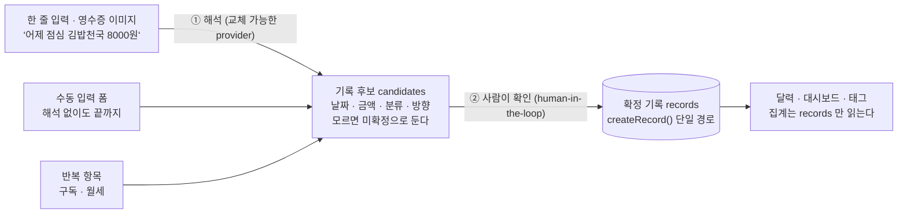
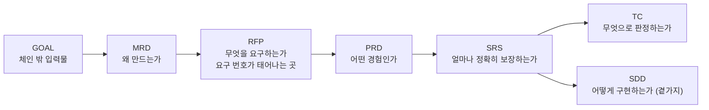

# 한줄 가계부 (Hanjul — One-Line Expense Tracker)

> 말하듯 한 줄 적거나 영수증 사진 한 장만 주면 날짜·금액·분류·수입/지출을 알아서 채워 **확인 카드**로 올려 주고, 사람이 한 번 눌러야 기록이 되는 개인용 가계부 웹. 화면의 중심은 **달력**이다.

가계부는 기능이 없어서가 아니라 **쓰기 귀찮아서** 실패한다. 금액·분류·날짜를 매번 폼에 나눠 넣는 순간 기록이 끊기고, 기록이 끊기면 분석은 의미가 없다. 그래서 이 제품은 **입력의 마찰을 0에 가깝게 만드는 것** 하나에 집중한다 — 다만 해석 결과를 바로 저장하지는 않는다.



후보(`candidates`)와 기록(`records`)은 **다른 표**다. 확인 동작을 거치지 않은 것은 합계에 들어가지 않는다.

---

## 목차

**[1. 개요](#1-개요)**
- [1.1 문제와 대상](#11-문제와-대상)
- [1.2 핵심 설계 결정](#12-핵심-설계-결정)
- [1.3 화면 구성](#13-화면-구성)

**[2. 아키텍처](#2-아키텍처)** — *작성 예정*

**[3. 동작 방식](#3-동작-방식)** — *작성 예정*

**[4. 프라이버시 경계](#4-프라이버시-경계)** — *작성 예정*

**[5. 참고](#5-참고)**
- [5.1 기술 스택](#51-기술-스택)
- [5.2 저장소 구조](#52-저장소-구조)
- [5.3 요구문서 체계](#53-요구문서-체계)
- [5.4 테스트·검증](#54-테스트검증)
- [5.5 로컬 실행](#55-로컬-실행)

---

## 1. 개요

### 1.1 문제와 대상

혼자 쓰는 개인 도구다. 계정도, 권한도, 공유도 없다. 데이터는 내 기기 안의 SQLite 파일 하나(`data/expense.db`)에 있다.

| 항목 | 내용 |
|---|---|
| 사용 대상 | 나 혼자 · 로그인 없음 (단일 사용자) |
| 핵심 가치 | 발견이 아니라 **지속** — 입력 마찰을 없애 기록이 끊기지 않게 한다 |
| 주 동선 | 메인 화면 하단 프롬프트에 한 줄 → 확인 카드 → 저장 |
| 대안 동선 | 달력에서 날짜를 눌러 여는 **수동 입력 폼** (자연어가 틀렸을 때 돌아갈 곳) |
| 자연어의 사정거리 | **기록 입력만.** 조회·수정·삭제·설정은 명확한 UI가 맡는다 |
| 판단 경계 | 해석은 후보까지만 만든다. **확정은 사람이 누른다** |
| 범위 밖 | 은행·카드 연동, 다중 사용자, 모바일 앱, 다중 통화·다국어, 자산·투자 관리 |

### 1.2 핵심 설계 결정

맨 위 그림을 지탱하는 세 가지 결정이 있다. 근거와 대안 기각 사유는 [SDD §3 (ADR)](docs/sdd/SDD.md)에 있다.

**결정 1 — 후보와 기록을 다른 표로 나눈다.** 해석 결과는 `candidates` 에 서고, 확정 기록은 오직 `createRecord()` 를 지나 `records` 에 들어간다. 확인 없이 `records` 로 가는 경로를 만들지 않는다. 집계·조회는 `records` 만 읽으므로, 틀린 해석이 합계를 오염시키는 길이 구조적으로 없다(`FR-ENTRY-05`).

**결정 2 — 모르는 것은 지어내지 않고 미확정으로 둔다.** 날짜·금액·분류·방향 네 항목은 각각 값 또는 **미확정**을 가진다. 자동 배정 분류는 언제나 사용자가 만든 분류 집합의 원소이며, 마땅한 것이 없으면 `null` 로 남긴다 — 없는 분류를 만들어 붙이지 않는다(`FR-CAT-06`). 같은 이유로 조회는 "찾지 못함"과 "없었음"을 구분해 돌려준다(`FR-VIEW-07`).

**결정 3 — 밖으로 나가는 문은 하나뿐이다.** 외부 호출은 `src/lib/interpret/gemini.ts` 에만 존재하고, 그 밖 어디에도 `fetch` 를 쓰지 않는다. 소스를 훑어 이를 검사하는 시험(`test/boundary.test.ts`)이 있다. 외부 수단이 없거나 실패하면 기기 안 규칙 기반 해석(`heuristic.ts`)으로 내려가며, 그때도 수동 입력 경로는 그대로 산다(`FR-ENTRY-14`). 영수증 **원본 이미지는 로컬에만** 남는다.

### 1.3 화면 구성

탭은 다섯이고 **한 탭은 한 목적만** 맡는다. 늘리거나 줄이기 전에 [ADR-013](docs/sdd/SDD.md)을 먼저 고친다.

| 경로 | 화면 | 역할 |
|---|---|---|
| `/` | 달력 | 이 제품의 중심. 날짜별 내역·일별 합계·월 이동, 날짜 팝업에서 수동 기록 전부 |
| `/dashboard` | 대시보드 | 이번 주·이번 달·올해의 추이, 분류별 비중, 수입 대비 지출 |
| `/tags` | 태그 | 분류 추가·이름 변경·보관 |
| `/search` | 검색 | 기간·분류·금액 범위·내용으로 확정 기록 찾기 |
| `/etc` | 기타 | 자동 배정 기억, 반복 항목, 반출·반입. 자리를 정하기 전의 임시 묶음 |

---

## 2. 아키텍처

> *작성 예정.* 서버 액션 경계(`src/app/actions.ts`) · 저장소 계층(`src/lib/repo/`) · 해석 경계(`src/lib/interpret/`)의 관계를 한 장으로 그린다. 현재 근거는 [SDD](docs/sdd/SDD.md) §2.

---

## 3. 동작 방식

> *작성 예정.* 다음 순서로 채운다.
>
> - 3.1 입력 → 후보 (`stageFromInput`) — 다건 분해, 한국어 날짜·방향 규칙
> - 3.2 해석 수단 선택과 대체 (`PROVIDERS` 배열)
> - 3.3 확인 → 확정 (`confirmCandidateAction`)
> - 3.4 분류 자동 배정과 학습 (`merchant_rules`)
> - 3.5 집계와 조회 (달력·대시보드·검색)
> - 3.6 예산 · 반복 항목
> - 3.7 반출·반입

---

## 4. 프라이버시 경계

> *작성 예정.* "무엇이 나가는가"를 사용자에게 보여 주는 목록(`FR-ENTRY-16`)과 실제 전송 항목이 어긋나지 않도록 유지하는 방법을 적는다. 현재 규칙: 외부 전송은 해석 요청 시에만, 원본 이미지는 로컬 보관, `GEMINI_API_KEY` 는 서버에서만 읽는다.

---

## 5. 참고

### 5.1 기술 스택

| 계층 | 구성 |
|---|---|
| 프레임워크 | Next.js 16 (App Router · Turbopack) · React 19 · TypeScript |
| 저장 | `node:sqlite` (Node 24 내장) — 네이티브 빌드 없음. 파일은 `data/expense.db` |
| 화면 | HeroUI v3 · Tailwind v4 |
| 차트 | Recharts 3 |
| 해석 | Gemini (`gemini-3.6-flash`) — 미가용 시 기기 안 규칙 기반 fallback |
| 시험 | Vitest · TC 대조 스크립트 (`test/generate-report.mjs`) |

### 5.2 저장소 구조

```
.
├── src/app/
│   ├── page.tsx                 # 달력(홈) — 이 제품의 중심 화면
│   ├── dashboard/ · tags/       # 나머지 두 탭
│   ├── actions.ts               # 서버 액션 — 화면의 모든 변경이 지나는 곳
│   ├── api/export · api/image   # 반출 묶음(JSON/CSV) · 근거 이미지
│   └── ui/                      # CalendarBoard · PromptBar · CandidateDialog · Charts …
├── src/lib/
│   ├── domain/                  # 타입 · 날짜(지역시 'YYYY-MM-DD') · 금액(정수 원)
│   ├── db/                      # DDL · append-only 마이그레이션 · 기본 분류 seed
│   ├── repo/                    # 저장소 — 모든 함수가 마지막 인자로 db 를 받는다
│   ├── interpret/               # ★ 해석 경계 — 밖으로 나가는 일은 gemini.ts 에만
│   └── transfer/                # 반출·반입 (기록과 이미지를 한 묶음으로)
├── test/                        # Vitest + TC 대조 · 문서 드리프트 검사
├── docs/                        # 요구 문서 — 권위
└── data/                        # 사용자 데이터 · 이미지 원본 (커밋 금지)
```

주요 표: `records`(확정 기록) · `candidates`(후보) · `categories`(보관은 `archived_at`) · `images` · `budgets` · `recurring` · `merchant_rules`.

### 5.3 요구문서 체계

요구의 권위는 `docs/` 에 있다. README와 어긋나면 문서가 이기고, 구조가 실제로 어떤지는 코드가 이긴다.



| 문서 | 내용 |
|---|---|
| [GOAL](docs/GOAL.md) | 만들고 싶은 것 · 결정 사항(D-01~D-11) · 아직 열려 있는 질문 |
| [MRD](docs/mrd/MRD.md) | 문제 · 대안 · 우선순위 · 성공의 확인 방법 |
| [RFP](docs/rfp/RFP.md) | 범위 · `FR-<COMP>-NN` · `NFR-<COMP>-NN` |
| [PRD](docs/prd/PRD.md) | 사용자 과업 · 흐름 · 완료 조건 |
| [SRS](docs/srs/SRS.md) | 검증 가능한 요구 · 수치 합격선(§3 이 단독 소유) |
| [SDD](docs/sdd/SDD.md) | 설계 · ADR(되돌리면 안 되는 결정) |
| [TC](docs/tc/) | 시험 기준서 — `TC-<COMP>-NN` 이 여기서 태어난다 |

컴포넌트는 셋이다: **ENTRY**(기록) · **CAT**(분류) · **VIEW**(보기).

### 5.4 테스트·검증

작업 단위는 **코드 → TC → 검증 → 문서 역반영 → 재검증**이 한 묶음이다. 문서 역반영이 됐는지는 사람이 아니라 기계가 본다.

```bash
npm run verify
```

이 하나가 아래 셋을 순서대로 돈다.

| 명령 | 무엇을 본다 |
|---|---|
| `npm run typecheck` | 타입 오류 0 |
| `npm run report` | 시험 실패 0 · TC ↔ 테스트 태그 대조에서 orphan 0 |
| `npm run check:docs` | 문서 드리프트 0 — 요구 ID 가 RFP→PRD→SRS→SDD 에서 일치하는가 · 하위 문서의 `기준 문서` 버전이 실제 상위 버전과 같은가 · ADR 에 빈 칸이 없는가 · 코드 주석이 인용한 요구 번호가 SRS 에 실재하는가 |

**검사기가 빨간불이면 그 작업은 끝나지 않은 것이다.**

### 5.5 로컬 실행

Node 24 이상이 필요하다(`node:sqlite` 내장 모듈을 쓴다).

```bash
npm install
```

```bash
cp .env.example .env.local
```

`.env.local` 에 `GEMINI_API_KEY` 를 넣는다. 키가 없어도 서버는 뜨고, 해석은 기기 안 규칙 기반으로 내려간다.

```bash
npm run dev
```

`data/` 와 `.env*` 는 커밋하지 않는다 — 가계 기록과 API 키가 들어간다.
