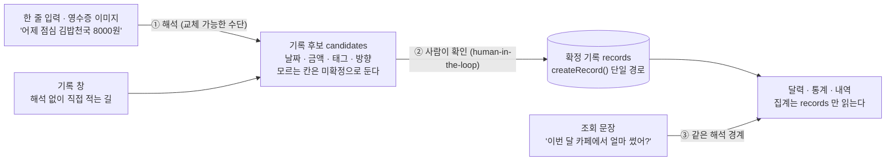
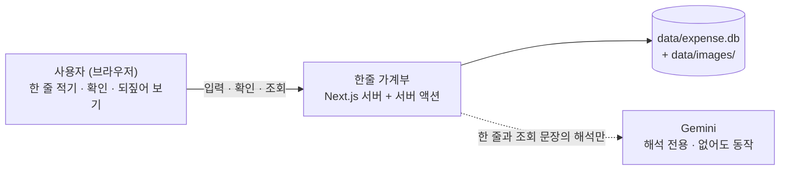
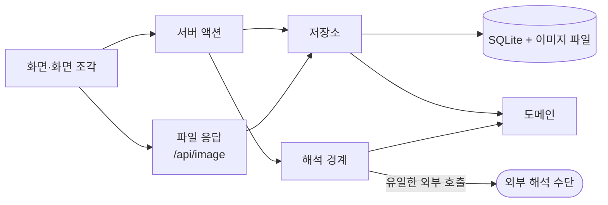
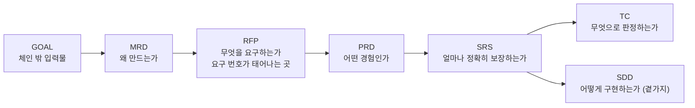

# 한줄 가계부 (Hanjul — One-Line Expense Tracker)

> 말하듯 한 줄 적거나 영수증 사진 한 장을 주면 날짜·금액·태그·수입/지출이 채워진 **기록 후보**가 서고, 사람이 한 번 확인해야 기록이 되는 개인용 가계부 웹. 화면의 중심은 **달력**이고, 되짚어 보는 일도 한 줄로 묻는다.

가계부는 기능이 없어서가 아니라 **쓰기 귀찮아서** 실패한다. 금액·분류·날짜를 매번 폼에 나눠 넣는 순간 기록이 끊기고, 기록이 끊기면 집계는 의미가 없다. 그래서 이 제품은 **입력의 마찰을 없애는 일** 하나에 집중한다 — 다만 해석한 것을 그대로 저장하지는 않는다. 기계가 알아들은 것과 사람이 인정한 것은 다른 표에 담긴다.



후보(`candidates`)와 기록(`records`)은 **다른 표**다. 확인을 거치지 않은 것은 어떤 합계에도 들어가지 않는다.

---

## 목차

**[1. 개요](#1-개요)**
- [1.1 문제와 대상](#11-문제와-대상)
- [1.2 핵심 설계 결정](#12-핵심-설계-결정)
- [1.3 화면 구성](#13-화면-구성)

**[2. 아키텍처](#2-아키텍처)**
- [2.1 시스템 컨텍스트](#21-시스템-컨텍스트)
- [2.2 실행 구조](#22-실행-구조)
- [2.3 계층과 금지 경계](#23-계층과-금지-경계)

**[3. 동작 방식](#3-동작-방식)**
- [3.1 입력 → 후보 → 확정](#31-입력--후보--확정)
- [3.2 해석 수단 선택과 대체](#32-해석-수단-선택과-대체)
- [3.3 태그 자동 배정과 학습](#33-태그-자동-배정과-학습)
- [3.4 내역 — 한 줄로 되짚기](#34-내역--한-줄로-되짚기)
- [3.5 달력과 통계](#35-달력과-통계)
- [3.6 데이터 저장](#36-데이터-저장)

**[4. 프라이버시 경계](#4-프라이버시-경계)**

**[5. 참고](#5-참고)**
- [5.1 기술 스택](#51-기술-스택)
- [5.2 저장소 구조](#52-저장소-구조)
- [5.3 요구문서 체계](#53-요구문서-체계)
- [5.4 테스트·검증](#54-테스트검증)
- [5.5 로컬 실행](#55-로컬-실행)

---

## 1. 개요

### 1.1 문제와 대상

혼자 쓰는 개인 도구다. 계정도 권한도 공유도 없다. 데이터는 내 기기 안의 SQLite 파일 하나(`data/expense.db`)와 그 옆의 이미지 폴더에 있다.

| 항목 | 내용 |
|---|---|
| 사용 대상 | 나 혼자 · 로그인 없음 (단일 사용자) |
| 핵심 가치 | 정확한 분석이 아니라 **지속** — 입력 마찰을 없애 기록이 끊기지 않게 한다 |
| 주 동선 | 화면 하단 프롬프트 바에 한 줄 → 저장 전 확인 → 기록 |
| 대안 동선 | 달력에서 날짜를 눌러 여는 **기록 창** — 해석이 틀렸을 때 돌아갈 곳 |
| 자연어의 사정거리 | **기록 입력과 내역 조회 둘.** 고치기·지우기·태그 관리는 분명한 UI 가 맡는다 |
| 판단 경계 | 해석은 후보까지만 만든다. **확정은 사람이 누른다** |
| 범위 밖 | 은행·카드 연동, 다중 사용자, 모바일 앱, 다중 통화·다국어, 자산·투자 관리 |

### 1.2 핵심 설계 결정

맨 위 그림을 지탱하는 결정 셋이다. 근거와 기각한 대안은 [SDD §6 (ADR)](docs/sdd/SDD.md) 이 갖는다.

**결정 1 — 후보와 기록을 다른 표로 나눈다.** 해석 결과는 `candidates` 에 서고, 확정 기록은 오직 `createRecord()` 를 지나 `records` 에 들어간다. 확인 없이 `records` 로 가는 경로를 만들지 않는다. 집계·조회는 `records` 만 읽으므로 **틀린 해석이 합계를 오염시키는 길이 구조적으로 없다**(`FR-ENTRY-05`).

**결정 2 — 모르는 것은 지어내지 않고 미확정으로 둔다.** 날짜·금액·태그·방향 네 칸은 각각 값 또는 **미확정**을 가진다. 자동 배정 태그는 언제나 사용자가 만든 집합의 원소이고, 마땅한 것이 없으면 `null` 로 남는다 — 없는 태그를 만들어 붙이지 않는다(`FR-CAT-06`). 같은 이유로 조회는 "찾지 못함"과 "없었음"을 구분해 돌려준다(`FR-VIEW-07`).

**결정 3 — 밖으로 나가는 문은 하나뿐이다.** 외부 호출은 `src/lib/interpret/gemini.ts` 에만 존재하고 그 밖 어디에도 `fetch` 를 쓰지 않는다. 기록 입력과 내역 조회로 나가는 길이 둘이 되었을 때도 파일은 그대로 하나다(ADR-040). 소스를 훑고 시험 중 나가는 요청을 세는 두 시험(`test/boundary.test.ts`)이 이 사실을 판정한다. 외부가 없거나 실패하면 기기 안 규칙 해석(`heuristic.ts`)이 이어받고, 그때도 직접 적는 길은 그대로 산다(`FR-ENTRY-14`).

### 1.3 화면 구성

목적지는 넷이고 **한 목적지는 한 목적만** 맡는다. 늘리거나 줄이기 전에 [ADR-020·ADR-046](docs/sdd/SDD.md) 을 먼저 고친다.

| 경로 | 화면 | 역할 |
|---|---|---|
| `/` | 달력 | 이 제품의 중심. 월 이동과 날짜별 표시, 날짜를 누르면 그날의 상세 창. 합계는 두지 않는다 |
| `/dashboard` | 통계 | 기간 합계 · 태그별 지출(3D 파이 + 글자 목록) · 기간 추이. 주간·월간·연간을 `‹ ›` 로 옮긴다 |
| `/search` | 내역 | 묻고 답하는 대화 하나. 조건 칸을 두지 않는다 |
| `/settings` | 태그 | 태그를 만들고 이름을 고친다. 주소만 아직 `settings` 다 |

기록 입력은 어느 화면에서든 **하단 프롬프트 바 하나**다. 하단에 내비게이션을 두지 않는 이유가 그것이다(ADR-021).

---

## 2. 아키텍처

경계 밖에서 안으로 두 번 확대한다: 먼저 **무엇과 만나는가**, 다음으로 **무엇이 무엇을 부를 수 있는가**.

### 2.1 시스템 컨텍스트

혼자 쓰는 도구라 만나는 것이 적다. 브라우저와 기기 안의 파일, 그리고 **선택적인** 외부 해석 수단 하나뿐이다.



외부 의존은 **없어도 도는 것**이 전제다. `GEMINI_API_KEY` 가 없으면 규칙 기반 해석으로 내려가고(`isAvailable() = false`), 공휴일도 밖에 묻지 않고 기기 안 표(`domain/holiday.ts`)가 답한다. 키는 서버에서만 읽어 브라우저 번들에 들어가지 않는다.

### 2.2 실행 구조

프로세스는 Next.js 서버 하나다. 나누는 것은 프로세스가 아니라 **책임**이다.



화살표를 거스르는 참조는 없다. `EXT` 로 가는 화살표가 하나뿐인 것이 이 설계의 불변조건이며, 그 하나가 `interpret/gemini.ts` 다.

### 2.3 계층과 금지 경계

| 계층 | 소유 모듈 | 맡는 일 | 금지 |
|---|---|---|---|
| 화면 | `app/page.tsx` · `app/dashboard` · `app/search` · `app/settings` | 네 목적지의 조회와 배치 | 저장소·해석을 직접 부르지 않고 서버 액션을 지난다 |
| 화면 조각 | `app/ui/*` | 입력·표시·상호작용 | 저장, 외부 호출 |
| 변경의 문 | `app/actions.ts` | 화면에서 오는 **모든 변경**과 해석 요청 | 표시 규칙, 질의문 |
| 첫 진입 자료 | `lib/app/home.ts` | 달력 첫 화면이 필요한 것을 한 번에 모은다 | 표시 규칙 |
| 저장소 | `lib/repo/*` | 표 하나씩의 읽기·쓰기와 그 불변조건 | 외부 호출, 표시 문구 |
| 도메인 | `lib/domain/*` | 날짜·금액·공휴일·타입. 순수 함수 | 입출력 일체 |
| 해석 경계 | `lib/interpret/*` | 입력과 조회 문장의 해석, 수단 선택 | 기록 확정 |
| 저장 연결 | `lib/db/*` | 연결·DDL·기본 태그 | 도메인 판단 |

의존은 `app → lib` 한 방향이다. 저장소 함수는 마지막 인자로 `db` 를 받아 시험이 임시 DB 를 넘길 수 있게 한다 — 그 규칙을 어긴 함수는 시험할 수 없다.

---

## 3. 동작 방식

### 3.1 입력 → 후보 → 확정

1. `ui/PromptDock` 이 적은 문장과 첨부 이미지를 `stageFromInput` 에 넘긴다.
2. 이미지가 있으면 `repo/images` 가 **먼저 기기에 저장한다.** 형식이나 크기를 벗어나면 여기서 사유를 돌려주고 해석하지 않는다.
3. `interpret()` 이 수단을 골라 해석한다. 외부가 실패하면 규칙이 이어받고 `degraded` 로 그 사실을 함께 돌려준다(`NFR-ENTRY-03`).
4. 해석이 아무것도 만들지 못해도 **원문을 담은 후보 하나**를 세운다 — 적은 말이 사라지지 않는다(`FR-ENTRY-07`).
5. `ui/CandidateReview` 가 후보를 보여 준다. 여기를 지나지 않으면 기록이 되지 않는다.
6. `confirmCandidateAction` → `confirmCandidate` → **`createRecord`**. 확정 기록이 생기는 문은 이 함수 하나다.

한 문장에 여러 건이 들어 있으면 조각으로 나누고, **방향은 조각마다 따로 판정한다** — 문장 전체를 보면 뒤쪽의 "받았어"가 앞의 지출까지 수입으로 만든다.

### 3.2 해석 수단 선택과 대체

`PROVIDERS` 배열 하나가 교체 지점이다. 새 수단은 `interpret`·`interpretQuery` 둘을 구현해 배열에 들어가고, 그 밖의 코드는 바뀌지 않는다(`NFR-ENTRY-04`).

| 수단 | 언제 쓰이는가 | 밖으로 나가는가 |
|---|---|---|
| `gemini.ts` | `GEMINI_API_KEY` 가 있을 때 | 나간다 — 이 파일 하나뿐 |
| `heuristic.ts` | 키가 없거나 외부가 실패했을 때 | 나가지 않는다 |

외부 수단은 모델을 둘 쓴다 — `gemini-3.1-flash-lite` 를 먼저, 막히면 `gemini-3.6-flash` 로 넘어간다(ADR-044). 429·5xx 는 그쪽이 바쁜 것이므로 0.7초씩 늘리며 두 번까지 다시 묻고(ADR-043), 400·403·404 는 다시 물어도 같으므로 그 자리에서 다음 모델로 넘어간다. 갈아탄 사실은 서버 로그에 남는다 — 조용히 갈아타면 왜 답이 달라졌는지 알 수 없다.

### 3.3 태그 자동 배정과 학습

자동 배정은 **사용자가 만든 태그 집합 안에서만** 고른다. 확인 화면에서 사용자가 태그를 바꿨고 거래 대상이 있으면 그 쌍을 `merchant_rules` 에 남겨 다음부터 같은 곳에 같은 태그를 제안한다(`FR-CAT-07`). 그 태그가 나중에 보관되면 제안하지 않는다 — 보관은 삭제가 아니라 **선택지에서만 빼는 일**이라 지난 기록의 귀속은 그대로 남는다(`NFR-CAT-01`).

### 3.4 내역 — 한 줄로 되짚기

기록을 **적는** 길이 한 줄인데 **찾는** 길만 칸 일곱 개인 것은 같은 제품의 두 얼굴이다(ADR-040). 그래서 내역도 프롬프트 하나이고, 화면은 말풍선이 오가는 대화다.

1. `ui/SearchChat` 이 한 줄을 `searchTurnAction` 에 넘긴다.
2. `interpretQuery()` 가 **조회 몫의 배열**을 돌려준다. "지출과 수입 따로 보여줘"는 한 번 묻고 두 번 조회하는 일이라, 반환값이 조건 하나가 아니라 몫의 배열이다(ADR-042).
3. 몫이 하나도 없으면 **조회하지 않는다.** 조건 없는 전체 목록을 답으로 내놓으면 사용자는 자기 문장이 통했다고 읽는다.
4. 몫마다 `queryRecords` 를 돈다. 0 건일 때만 무엇으로 찾았는지를 적는다 — 그때만 '못 찾음'과 '잘못 알아들음'이 갈린다.

대화는 주소가 아니라 `sessionStorage` 에 있다. 결과를 눌러 달력에 다녀왔을 때 대화가 통째로 사라지지 않게 하려는 것이고, **링크로 결과를 건네줄 수 없게 된 것**이 그 값이다(ADR-041).

### 3.5 달력과 통계

달력은 월 이동과 날짜별 표시만 맡고 합계를 두지 않는다 — 세는 일은 통계가 맡는다. 날짜 숫자의 붉은색은 거래 방향이 아니라 **쉬는 날**이고, 공휴일은 이름을 함께 적어 색만으로 지지 않는다(ADR-022). 공휴일 표는 기기 안에 있고 2024~2032 를 안다.

통계의 기간은 **종류**(주간·월간·연간)와 **위치**(`‹ ›`) 둘이다. '이번 주·이번 달·올해'로만 두면 되짚어 보는 화면인데 지금밖에 볼 수 없다(ADR-030). 태그별 지출은 3D 파이지만 파이만 두지 않는다 — 이름·비중·금액을 글자로 적은 목록이 아래에 함께 서고, 그 목록이 자판으로 고르는 자리이기도 하다(ADR-031·ADR-035).

### 3.6 데이터 저장

| 표 | 무엇을 담는가 | 지켜야 할 것 |
|---|---|---|
| `categories` | 태그 | 삭제는 `archived_at` 보관 처리. 이름 유일 색인은 보관되지 않은 행에만 |
| `records` | 확정 기록 | `amount > 0` 과 `direction` 을 따로 둔다. 삭제는 `deleted_at` 표시 |
| `candidates` | 기록 후보 | `records` 와 다른 표. `suggested_category_id` 로 사용자가 태그를 바꿨는지 본다 |
| `images` | 근거 이미지의 자리 | 바이트는 `data/images/` 에 두고 여기에는 경로만 |
| `budgets` | 태그·기간별 예산 | 화면은 ADR-014 로 내렸고 계층은 살아 있다 |
| `merchant_rules` | 거래 대상 → 태그 | 거래 대상 하나에 가장 나중의 것 하나 |

`records` 의 색인은 모두 **`deleted_at IS NULL` 부분 색인**이다. 조회가 언제나 그 조건을 달고 들어오기 때문이다. 담는 모양이 바뀌면 `MIGRATIONS` 배열에 **덧붙이기만** 한다 — 이미 나간 항목의 질의문은 고치지 않는다. `recurring`·`recurring_emissions` 는 반복 기록이 비범위로 내려가며 읽고 쓰는 코드가 사라졌으나, 그 규칙 때문에 표만 남아 있다(ADR-047).

---

## 4. 프라이버시 경계

혼자 쓰는 가계부라 밖으로 나가는 것이 가장 민감하다. 규칙은 넷이고, 그중 셋은 기계가 본다.

| 규칙 | 무엇을 지키는가 | 어떻게 판정하는가 |
|---|---|---|
| 외부 호출은 `interpret/gemini.ts` 에만 있다 | 해석 외의 목적으로 내보내지 않는다(`FR-ENTRY-15`) | `TC-ENTRY-36` 이 소스를 훑고, `TC-ENTRY-35` 가 시험 중 나가는 요청을 센다 |
| 나가는 길은 둘 — 기록 입력과 내역 조회 | 길이 늘면 위 판정의 근거가 무너진다 | 같은 두 시험. 파일을 하나 더 만들어 거기서 부르면 잡힌다 |
| 영수증 **원본 이미지는 기기에만** 남는다 | 이미지가 DB 나 다른 응답으로 새지 않는다 | `repo/images` 가 `data/images/` 에 두고 DB 에는 경로만 담는다 |
| 첨부 전에 전송 사실과 가림 권고를 함께 알린다 | 보내기 전에 알 수 있어야 한다(`FR-ENTRY-18`) | `TC-ENTRY-39` 가 안내 문구에 두 낱말이 다 있는지 본다 |

`GEMINI_API_KEY` 는 서버에서만 읽고 클라이언트 번들에 넣지 않는다. `data/` 와 `.env*` 는 커밋하지 않는다 — 가계 기록과 키가 들어간다.

외부로 나가는 것을 늘리려면 **코드보다 문서를 먼저 고친다.** 내역 조회가 검색어를 밖으로 보내게 되었을 때 실제로 RFP→PRD→SRS 를 먼저 고치고 코드를 썼다.

---

## 5. 참고

### 5.1 기술 스택

| 계층 | 구성 |
|---|---|
| 프레임워크 | Next.js 16 (App Router · Turbopack) · React 19 · TypeScript |
| 저장 | `node:sqlite` (Node 24 내장) — 네이티브 빌드 없음. 파일은 `data/expense.db` |
| 화면 | HeroUI v3 · Tailwind v4 |
| 차트 | Recharts 3 — 태그별 지출의 3D 파이만 직접 그린다(ADR-035) |
| 해석 | Gemini `gemini-3.1-flash-lite` → `gemini-3.6-flash` · 미가용 시 기기 안 규칙 기반 |
| 시험 | Vitest · TC 대조와 문서 드리프트 검사 스크립트 |

### 5.2 저장소 구조

```
.
├── src/app/
│   ├── page.tsx                 # 달력(홈) — 이 제품의 중심 화면
│   ├── dashboard/ search/ settings/   # 통계 · 내역 · 태그
│   ├── actions.ts               # 서버 액션 — 화면의 모든 변경이 지나는 곳
│   ├── api/image/               # 근거 이미지 바이트
│   └── ui/                      # PromptDock · CalendarWorkspace · SearchChat · RecordDialog · Charts …
├── src/lib/
│   ├── domain/                  # 타입 · 날짜(지역시 'YYYY-MM-DD') · 금액(정수 원) · 공휴일
│   ├── db/                      # DDL · append-only 마이그레이션 · 기본 태그 seed
│   ├── repo/                    # 저장소 — 모든 함수가 마지막 인자로 db 를 받는다
│   ├── interpret/               # ★ 해석 경계 — 밖으로 나가는 일은 gemini.ts 에만
│   └── app/home.ts              # 첫 화면이 필요한 것을 한 번에 모은다
├── test/                        # Vitest + TC 대조 · 문서 드리프트 검사
├── docs/                        # 요구 문서 — 권위
└── data/                        # 가계 기록과 이미지 원본 (커밋 금지)
```

### 5.3 요구문서 체계

요구의 권위는 `docs/` 에 있다. README 와 어긋나면 문서가 이기고, 구조가 실제로 어떤지는 코드가 이긴다.



층이 다르면 **문장의 주어도 다르다.** MRD 는 사람이, RFP 는 사용자·제품이, PRD 는 Given-When-Then 이, SRS 는 시스템이 주어다. 층이 언어를 바꾸지 않으면 그 층은 윗층의 초벌이 되어 존재할 이유가 없어진다.

| 문서 | 내용 | 현재 |
|---|---|---|
| [GOAL](docs/GOAL.md) | 만들고 싶은 것 · 결정 사항 · 열려 있는 질문 | 체인 밖 |
| [MRD](docs/mrd/MRD.md) | 문제 · 대안 · 우선순위 · 성공의 확인 방법 | v0.9 |
| [RFP](docs/rfp/RFP.md) | 범위·비범위 · `FR-<COMP>-NN` · `NFR-<COMP>-NN` | v1.3 |
| [PRD](docs/prd/PRD.md) | 에픽 · 스토리 · 수용 조건 | v1.5 |
| [SRS](docs/srs/SRS.md) | 검증 가능한 요구 · 수치 합격선(§3 이 단독 소유) | v1.4 |
| [SDD](docs/sdd/SDD.md) | 구조 · 데이터 · 흐름 · ADR | v3.2 |
| [TC](docs/tc/) | 시험 기준서 — `TC-<COMP>-NN` 이 여기서 태어난다 | ENTRY v1.5 · CAT v1.0 · VIEW v1.6 |

컴포넌트는 셋이다: **ENTRY**(기록) · **CAT**(태그) · **VIEW**(되짚어 보기). 요구 번호는 **덧붙이기만** 한다 — 범위에서 내려간 요구도 지우지 않고 취소선으로 남겨, 되살릴 때 무엇을 다시 약속하는지가 보이게 한다.

### 5.4 테스트·검증

작업 단위는 **코드 → TC → 검증 → 문서 역반영 → 재검증**이 한 묶음이다. 역반영이 됐는지는 사람이 아니라 기계가 본다.

```bash
npm run verify
```

이 하나가 아래 셋을 순서대로 돈다.

| 명령 | 무엇을 본다 |
|---|---|
| `npm run typecheck` | 타입 오류 0 |
| `npm run report` | 시험 실패 0 · TC ↔ 테스트 태그 대조에서 **orphan 0** |
| `npm run check:docs` | 문서 드리프트 0 |

`check:docs` 가 보는 것: 요구 ID 가 RFP→PRD→SRS→SDD 에서 일치하는가 · 하위 문서의 `기준 문서` 버전이 실제 상위 버전과 같은가 · ADR 행에 빈 칸이 없는가 · 코드 주석이 인용한 요구 번호가 SRS 에 실재하는가 · 시험 유형 요구에 TC 가 있는가 · **층마다의 문장 주어가 지켜졌는가**(RFP 에 "시스템은"이 0 건인가).

문서가 글로만 규칙을 적어 두면 지켜질 확률만 올라간다. 그래서 검사를 기계에 맡겼다 — **검사기가 빨간불이면 그 작업은 끝나지 않은 것이다.**

### 5.5 로컬 실행

Node 24 이상이 필요하다(`node:sqlite` 내장 모듈을 쓴다).

```bash
npm install
```

```bash
cp .env.example .env.local
```

`.env.local` 에 `GEMINI_API_KEY` 를 넣는다. 키가 없어도 서버는 뜨고, 해석은 기기 안 규칙 기반으로 내려간다.

```bash
npm run dev
```

첫 실행에서 `data/expense.db` 가 만들어지고 기본 태그 열넷이 들어간다 — **비어 있을 때만** 넣으므로 전부 지운 상태가 되살아나지 않는다.
