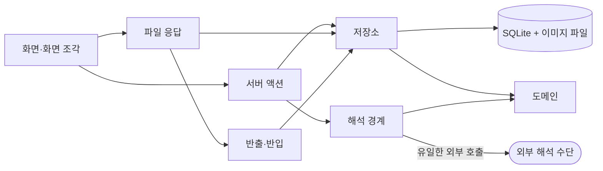

# SDD — 한줄 가계부

| 항목 | 내용 |
|---|---|
| 문서 역할 | 소프트웨어 설계 문서(SDD) — "어떻게 구현하는가"에 답한다. 체인의 곁가지 |
| 버전 | 3.1 |
| 최종 개정일 | 2026-09-15 |
| 기준 문서 | [SRS.md](../srs/SRS.md) v1.2 |
| 코드 재검증 기준 | commit `1bed977` |
| 상태 | Draft |

---

## 목차

- [1. 목적과 규범 우선순위](#1-목적과-규범-우선순위)
- [2. 설계 불변조건](#2-설계-불변조건)
- [3. 실행 구조와 책임 경계](#3-실행-구조와-책임-경계)
- [4. 데이터 설계](#4-데이터-설계)
- [5. 주요 흐름](#5-주요-흐름)
- [6. 설계 결정 기록 (ADR)](#6-설계-결정-기록-adr)
- [7. SRS 추적](#7-srs-추적)
- [8. 미결 사항](#8-미결-사항)

## 1. 목적과 규범 우선순위

이 문서는 SRS의 요구를 **무엇으로 어떻게 실현하는가**와 그 선택의 이유를 소유한다.
요구 번호가 이 문서에서 새로 생기지 않으며, TC의 검증 대상도 아니다.

충돌할 때의 우선순위는 셋 중 이 문서가 **최하위**다.

1. 구조가 실제로 어떤지는 **실행 코드**가 이긴다.
2. 무엇을 보장해야 하는지는 **SRS**가 이긴다.
3. 이 문서는 둘 다에 대해 최하위이며, 어긋나면 이 문서를 고친다.

구현하며 겪은 함정과 그 회피법은 이 문서가 아니라 `.claude/CLAUDE.md` §7 정책
로그가 소유한다. 여기에는 **무엇을 정했고 왜 그것을 골랐는지**만 남긴다.

## 2. 설계 불변조건

어떤 변경에서도 지켜야 할 구조 규칙이다. 각 항목은 그것이 존재하는 이유가 되는
SRS 요구를 가리킨다.

1. **외부 해석 수단은 하나의 경계 뒤에만 존재한다.** 해석을 호출하는 코드가 그
   경계 밖에 생기면 위반이다. (`NFR-ENTRY-04`, `FR-ENTRY-14`)
2. **외부 통신은 그 해석 경계에서만 발생한다.** 다른 어떤 계층도 바깥으로 나가지
   않는다. (`FR-ENTRY-15`, `NFR-ENTRY-05`)
3. **기록 후보와 확정 기록은 서로 다른 저장 경로를 가진다.** 확인 동작을 거치지
   않은 자료가 확정 기록의 경로에 들어가는 길이 없어야 한다. (`FR-ENTRY-05`,
   SRS §4 불변조건 1)
4. **집계·표시 계층은 확정 기록만 읽는다.** 기록 후보를 읽는 집계 경로가 있으면
   위반이다. (SRS §4 불변조건 7)
5. **기록에서 분류로 가는 참조는 식별자로만 유지한다.** 이름을 참조 키로 쓰면
   위반이다. (`NFR-CAT-01`)
6. **삭제는 표시로 하고 자료를 지우지 않는다.** (`FR-ENTRY-11`, SRS §7)

1과 2는 `test/boundary.test.ts` 가 소스를 훑어 검사한다.

## 3. 실행 구조와 책임 경계

### 3.1 실행 단위

배포 단위는 Next.js 앱 하나다(ADR-001). 그 안에서 코드가 도는 자리는 셋이다.

| 자리 | 무엇이 도는가 | 바깥으로 나갈 수 있는가 |
|---|---|---|
| 서버 컴포넌트·서버 액션·라우트 핸들러 | 조회·집계·저장·해석 호출 | 해석 경계에 한해 가능 |
| 브라우저 | 화면 조각의 상태와 입력 | 불가 |
| 기기의 파일 시스템 | `data/expense.db` 와 `data/images/` | 해당 없음 |

해석 키(`GEMINI_API_KEY`)는 서버에서만 읽는다. 클라이언트 번들에 들어가면
불변조건 2가 깨진다.

화살표를 거스르는 참조는 없다. `EXT` 로 가는 화살표가 하나뿐인 것이
불변조건 2이며, 그 하나는 `interpret/gemini.ts` 다.

### 3.2 계층별 책임과 금지 경계

| 계층 | 소유 모듈 | 맡는 일 | 금지 |
|---|---|---|---|
| 화면 | `app/page.tsx` · `app/dashboard` · `app/search` · `app/settings` | 네 목적지의 조회와 배치(ADR-020·ADR-030) | 저장소·해석을 직접 부르지 않고 서버 액션을 지난다 |
| 화면 조각 | `app/ui/*` | 입력·표시·상호작용 | 저장, 외부 호출 |
| 변경의 문 | `app/actions.ts` | 화면에서 오는 **모든 변경**과 해석 요청 | 표시 규칙, 질의문 |
| 파일 응답 | `app/api/export` · `app/api/export/csv` · `app/api/image/[id]` | 묶음·CSV·이미지 바이트 | 기록 변경 |
| 첫 진입 자료 | `lib/app/home.ts` | 달력 첫 화면이 필요한 것을 한 번에 모은다 | 표시 규칙 |
| 저장소 | `lib/repo/*` | 표 하나씩의 읽기·쓰기와 그 불변조건 | 외부 호출, 표시 문구 |
| 도메인 | `lib/domain/*` | 날짜·금액·공휴일·타입. 순수 함수 | 입출력 일체 |
| 해석 경계 | `lib/interpret/*` | 입력과 조회 문장의 해석, 수단 선택 | 기록 확정 |
| 반출·반입 | `lib/transfer/index.ts` | 묶음 만들기·들여오기 | 외부 호출 |
| 저장 연결 | `lib/db/*` | 연결·DDL·기본 분류 | 도메인 판단 |

의존은 `app → lib` 한 방향이다. `lib` 이 `app` 을 참조하면 위반이다.
저장소 함수는 마지막 인자로 `db` 를 받아 시험이 임시 DB 를 넘길 수 있게 한다.

### 3.3 해석 경계

경계 안은 셋으로 나뉜다.

| 파일 | 맡는 일 |
|---|---|
| `interpret/index.ts` | 수단 선택과 대체. 교체 지점은 `PROVIDERS` 배열 하나다 |
| `interpret/gemini.ts` | **제품에서 `fetch` 가 있는 유일한 파일.** 키가 없으면 `isAvailable()` 이 거짓이다 |
| `interpret/heuristic.ts` | 기기 안 규칙. 네트워크가 없고, 외부가 죽었을 때의 길이다 |

두 수단은 `InterpretProvider` 라는 같은 계약을 구현한다(`interpret` · `interpretQuery`).
그래서 외부가 실패해도 이어받는 길이 계약 수준에서 살아 있다(ADR-010).
규칙 쪽의 재료는 `korean.ts`(날짜·방향·거래 대상) · `queryRules.ts`(조회 문장) ·
`categoryHint.ts`(낱말 → 분류) 가 나눠 갖는다.

## 4. 데이터 설계

SRS §7 의 논리 계약을 SQLite 파일 하나로 실현한다(ADR-002). 물리 스키마는
`lib/db/schema.ts` 가 소유한다.

### 4.1 표

| 표 | 무엇을 담는가 | 지켜야 할 것 |
|---|---|---|
| `categories` | 분류 | 삭제는 `archived_at` 보관 처리(ADR-009). 이름 중복 금지는 보관되지 않은 행에만 건다 |
| `records` | 확정 기록 | `amount > 0` 과 `direction` 을 따로 둔다. 삭제는 `deleted_at` 표시 |
| `candidates` | 기록 후보 | `records` 와 다른 표다. `suggested_category_id` 로 사용자가 분류를 바꿨는지 판정한다 |
| `images` | 근거 이미지의 자리 | 바이트는 `data/images/` 에 두고 여기에는 경로만(ADR-007) |
| `budgets` | 분류·기간별 예산 | `(category_id, period_key)` 가 유일하다 |
| `recurring` | 반복 항목 | `anchor_day` 는 1~31 |
| `recurring_emissions` | 어느 기간에 후보를 냈는지 | 사용자가 후보를 버려도 남는다 |
| `merchant_rules` | 거래 대상 → 분류 | 거래 대상 하나에 가장 나중의 것 하나 |

### 4.2 색인과 조회 규칙

- `records` 의 날짜·분류·방향 색인은 모두 **`deleted_at IS NULL` 부분 색인**이다.
  조회가 언제나 그 조건을 달고 들어오기 때문이다.
- `categories` 의 이름 유일 색인도 `archived_at IS NULL` 부분 색인이다.
  보관된 이름은 다시 쓸 수 있다.
- 집계(`totalsForPeriod` · `categoryBreakdown` · `periodSeries`)는 `records` 만
  읽는다. 후보를 읽는 집계 경로가 생기면 불변조건 4 위반이다.

### 4.3 마이그레이션

`MIGRATIONS` 는 **덧붙이기만 하는 배열**이다. 이미 나간 항목의 질의문을 고치지
않는다. 담는 모양이 바뀌면 항목을 새로 더한다.

## 5. 주요 흐름

### 5.1 기록 입력 → 후보 → 확정

1. `ui/PromptDock` 이 적은 문장과 첨부 이미지를 `stageFromInput` 에 넘긴다.
2. 이미지가 있으면 `repo/images` 가 먼저 기기에 저장한다. 형식이나 크기를 벗어나면
   여기서 사유를 돌려주고 해석하지 않는다.
3. `interpret()` 이 수단을 골라 해석한다. 외부가 실패하면 규칙이 이어받고
   `degraded` 로 그 사실을 함께 돌려준다(`NFR-ENTRY-03`).
4. 해석이 아무것도 만들지 못해도 **원문을 담은 후보 하나**를 세운다(`FR-ENTRY-07`).
5. `ui/CandidateReview` 가 후보를 보여 준다. 여기를 지나지 않으면 기록이 되지
   않는다(`FR-ENTRY-05`).
6. `confirmCandidateAction` → `confirmCandidate` → **`createRecord`**. 확정 기록이
   생기는 문은 이 함수 하나다.
7. 확인 전에 분류를 바꿨고 거래 대상이 있으면 `merchant_rules` 에 남긴다(`FR-CAT-07`).

반복 항목은 4번 자리에 따로 들어온다. `home.ts` 가 첫 화면을 만들 때
`emitDueRecurring` 이 그 달치 후보를 한 번만 낸다(`FR-ENTRY-12`).

### 5.2 조회 문장 → 조건 → 결과

1. `ui/SearchChat` 이 한 줄을 `searchTurnAction` 에 넘긴다.
2. `interpretQuery()` 가 **조회 몫의 배열**을 돌려준다. 몫마다 조건과 알아들은
   조건을 갖는다(ADR-042).
3. 몫이 하나도 없으면 **조회하지 않는다.** 조건 없는 전체 목록을 답으로 내놓지
   않기 위해서다(`FR-VIEW-13`).
4. 몫마다 `queryRecords` 를 돈다. 조회하는 길은 조건 검색과 같은 하나다(`FR-VIEW-06`).

### 5.3 반출·반입

- 반출은 `GET /api/export` 가 `exportBundle` 로 기록·분류·예산·반복·규칙·이미지를
  한 묶음에 담는다(ADR-008). `?images=0` 이면 이미지를 뺀다.
- `GET /api/export/csv` 는 표 계산용이고 **복원용이 아니다.** 삭제된 기록과
  이미지를 담지 않는다.
- 반입은 `importBundleAction` → `importBundle` 이다. 형식 표지와 판 번호를 보고,
  겹치는 식별자는 건너뛰며, 실패하면 되돌려 아무것도 바꾸지 않는다.

## 6. 설계 결정 기록 (ADR)

바뀐 결정은 지우지 않고 `Superseded(→ADR-0NN)` 로 표시한 뒤 새 행을 더한다.
결정의 배경이 된 실측과 시행착오는 `.claude/CLAUDE.md` §7 이 갖는다.

| ID | 날짜 | 결정 | 검토한 대안 | 선택 이유 | 비용·한계 | 되돌릴 조건 | 상태 |
|---|---|---|---|---|---|---|---|
| ADR-001 | 2026-09-08 | 앱을 Next.js 단일 프로젝트로 구성한다 | ① React SPA + 별도 백엔드 ② 백엔드 없이 프론트만 | 해석 키를 서버에 두어 불변조건 2를 지킬 수 있고, 유지 인력이 한 사람이라 배포 단위가 하나여야 한다 | 한쪽 문제가 전체에 영향을 준다 | 해석 처리가 서버에서 감당되지 않을 때 | Active |
| ADR-002 | 2026-09-08 | 확정 기록과 부속 자료를 로컬 SQLite 파일에 둔다 | ① 브라우저 내부 저장 ② 클라우드 관리형 백엔드 | 기기 내부 보관을 파일 위치 확인만으로 검사할 수 있고, 다중 조건 조회와 기간 집계를 질의로 처리한다 | 기기를 옮기면 기록이 따라오지 않아 반출이 실질적 이동 수단이 된다 | 여러 기기에서의 사용이 요구가 될 때 | Active |
| ADR-003 | 2026-09-08 | 입력 해석을 Gemini 무료 티어로 하되 교체 가능한 경계 뒤에 둔다 | ① 규칙·사전 기반 파싱 ② 로컬 모델 ③ 유료 API 고정 | 무료로 문장과 이미지를 한 수단으로 처리할 수 있는 것이 이것뿐이었다. 경계는 사업자가 조건을 바꾼다는 제약에 대한 대비다 | 한도와 이용 조건을 통제할 수 없고 해석이 확률적이다 | 무료 한도가 실사용을 감당하지 못할 때(MRD M-04) | **Superseded(→ADR-010)** — 기각했던 규칙 기반이 상시 폴백으로 채택되어 전제가 바뀌었다 |
| ADR-004 | 2026-09-08 | 화면 구성 요소 체계로 HeroUI v3을 쓴다 | ① shadcn/ui + Tremor ② TailAdmin ③ Mosaic Lite ④ Mantine ⑤ daisyUI (후보 10개를 화면으로 비교) | 달력 구성 요소가 한국어로 표시되고 날짜 칸을 분해할 수 있어 `FR-VIEW-01` 에 직접 맞는다 | 차트가 없어 ADR-005가 필요하다 | 요구된 화면을 이 체계로 만들 수 없다고 판명될 때 | Active |
| ADR-005 | 2026-09-08 | 차트를 Recharts로 그리고 ADR-004의 토큰에 맞춘다 | ① Tremor 블록 ② ApexCharts ③ Chart.js | 완성된 차트 블록을 가져오면 서로 다른 디자인 언어가 한 화면에 섞인다. 그리는 도구만 가져온다 | 축·범례·툴팁을 직접 스타일링해야 한다 | 직접 스타일링 비용이 이질감보다 커질 때 | Active `실행 검증 필요` |
| ADR-006 | 2026-09-08 | 유료·도입 불가 자원은 쓰지 않고 **시각적 특성만 자체 구현으로 재현**한다. 코드와 에셋은 복제하지 않는다 | ① 유료 템플릿 구매 ② 무료 대체품을 쓰고 외형을 타협 ③ 해당 화면을 만들지 않음 | 유료 계약을 전제하지 않는다는 제약(RFP §7.2) 아래에서 ADR-004가 정한 방향을 유지하는 유일한 길이다 | 원본과 같아지지 않고 "얼마나 닮아야 충분한가"의 기준이 없다 | 재현 비용이 유료 도입 비용을 넘을 때 | Active |
| ADR-007 | 2026-09-08 | 근거 이미지를 DB 밖 파일로 두고 DB에는 경로만 둔다 | ① DB 안에 이미지까지 저장 ② 원본을 버리고 축소본만 보관 | DB가 이미지 때문에 커지지 않는다. 축소본만 두면 금액을 다시 확인하려는 `FR-ENTRY-13` 의 목적이 약해진다 | 저장이 두 곳으로 나뉘어 반출이 한 벌로 끝나지 않는다 | 파일 경로 관리가 깨져 참조를 잃는 일이 반복될 때 | Active |
| ADR-008 | 2026-09-08 | 반출은 기록과 근거 이미지를 **한 묶음**으로 한다 | ① 기록만 반출하고 이미지는 따로 백업 | ADR-007이 저장을 둘로 나눴으므로 묶지 않으면 `NFR-VIEW-03` 이 이미지에 대해 성립하지 않는다 | 반출 파일이 이미지 총량만큼 커진다 | 이미지 총량이 커져 반출 자체가 감당되지 않을 때 | Active |
| ADR-009 | 2026-09-08 | 분류 삭제를 행 삭제가 아니라 **보관 처리**로 한다(`archived_at`) | ① 행을 지우고 기록의 분류 참조를 비운다 ② 기록이 있는 분류는 못 지우게 한다 | ①은 `NFR-CAT-01` 을 깨고 ②는 `FR-CAT-03`·`FR-CAT-08` 이 전제한 "확인 후 삭제"를 없앤다. 보관만이 둘을 함께 만족한다 | 지운 분류의 이름이 지난 기록에는 계속 보인다 | 사용자가 "완전히 지우기"를 요구할 때 | Active |
| ADR-010 | 2026-09-08 | 해석 수단을 **둘로 상시 구성**한다. 외부가 없거나 실패하면 규칙이 이어받고 그 사실을 알린다 | ① 외부만 두고 실패 시 포기 ② 규칙만 두기 ③ ADR-003 원안(규칙 기반 기각) | 규칙 기반이 없으면 키가 없는 동안 `FR-ENTRY-14` 와 원칙 3을 구현할 수단이 사라진다. 임시 대체물이 아니라 그 요구의 구현체다 | 규칙의 해석 품질이 낮고, 어느 수단이 처리했는지 함께 알려야 한다 | 규칙의 정확도가 확인 단계의 교정 비용을 넘어설 때 | Active |
| ADR-011 | 2026-09-08 | 화면 셸을 **달력 중심**으로 하고 확인 단계를 입력 직후 뜨는 팝업으로 옮긴다 | ① 기록 전용 탭에 확인 카드를 쌓기 ② 확인 없이 자동 저장 ③ 목록 안 인라인 편집 | 사용자가 별도 확인 화면을 마찰로 지목했다. ②는 `FR-ENTRY-05` 를 정면으로 깬다 | 팝업을 닫으면 후보가 남아 '확인 대기' 표시가 따로 필요하다 | 팝업 편집이 불편하다는 것이 실사용으로 확인될 때 | **Superseded(→ADR-013, →ADR-020)** — 달력 중심과 확인 팝업은 살아 있고 탭이 셋이라는 부분만 대체되었다 |
| ADR-012 | 2026-09-08 | 화면 표기는 **태그**, 요구 문서는 **분류**로 두고 대응을 SRS §1.4에 고정한다 | ① 문서까지 전면 개명 ② 화면도 '분류' 유지 | 사용자는 이것을 태그로 인식한다. ①은 `FR-CAT-*` 와 ID 네임스페이스까지 바꿔야 해 추적성 위험이 크다 | 문서와 화면의 낱말이 다르다 | 문서 전면 개명을 결정할 때 | Active |
| ADR-013 | 2026-09-09 | 탭을 **다섯**으로 둔다(달력·대시보드·태그·검색·기타). 한 탭은 한 목적만 맡는다 | ① 탭 셋을 유지하고 검색을 대시보드 안에 ② 검색을 달력 안에 ③ 성격이 다른 것을 태그 탭에 쌓기 | 대시보드가 요약·예산·검색 셋을 겸해 세로로 길어졌고 동선의 목적이 서로 달랐다. 탭이 느는 비용보다 한 화면이 여러 목적을 겸하는 비용이 크다 | 고를 때의 부담이 커지고 '기타'는 이름이 내용을 설명하지 못한다 | '기타'의 셋이 자리를 찾을 때 | **Superseded(→ADR-020)** — '기타'가 임시 보관함으로 읽힌다는 것이 확인되어 네 목적지로 줄였다 |
| ADR-014 | 2026-09-09 | 예산의 **화면만 내리고** 저장·조회 계층은 남긴다. `FR-VIEW-08`·`FR-VIEW-09` 는 폐기하지 않는다 | ① 요구까지 폐기하고 저장 계층도 지운다 ② 화면을 그대로 둔다 ③ 다른 탭으로 옮긴다 | 사용자가 되돌릴 뜻을 밝히며 화면에서 내려 달라고 했다. ①은 RFP까지 거슬러 지웠다가 되살릴 때 그 작업을 되풀이해야 한다 | 요구는 살아 있는데 사용자가 예산을 정할 길이 없다. `US-07-03` 이 이 기간 동안 이행되지 않는다 | 사용자가 예산을 다시 쓰겠다고 할 때(RFP R-07 · PRD P-07) | Active |
| ADR-015 | 2026-09-09 | 날짜 팝업의 크기를 기록 수와 무관하게 고정하고 수동 입력을 바닥에 상시 둔다 | ① 내용에 따라 늘고 주는 방식 ② '추가'를 눌러야 펼쳐지는 방식 ③ 입력을 두 번째 팝업으로 | ①은 같은 자리를 눌러도 매번 다른 크기의 창이 뜬다. ②는 `FR-ENTRY-08` 의 수동 경로가 늘 열려 있다는 사실이 화면에서 보이지 않는다 | 기록이 목록 높이를 넘으면 스크롤이 강제되고 기록이 하나뿐인 날에도 빈 공간이 남는다 | 하루 기록 수가 목록 높이를 자주 넘을 때 | Active |
| ADR-016 | 2026-09-09 | 달력 칸을 **합계 우선**으로 채우고(날짜·지출·수입·태그 점) 오른쪽에 주계 열을 둔다. 격자는 앞뒤 달 날짜로 채운다 | ① 칸에 개별 항목을 미리 보여 주기 ② 합계만 두고 태그 점 없애기 ③ 앞뒤 달을 빈칸으로 ④ 주계 없이 월 합계만 | 달력에서 먼저 찾는 것은 "그날 얼마 썼나"이지 항목 이름이 아니다. 빈칸은 격자에 구멍을 내 달력으로 읽히지 않는다 | 열이 여덟이 되어 하루 칸이 좁아지고 태그가 열을 넘으면 점 색이 되풀이된다 | 칸이 좁아 금액이 잘릴 때 | **Superseded(→ADR-018)** — 주계 열이 격자의 열 너비를 깨뜨렸고 태그 점과 요일 색이 ADR-017의 색 규칙을 위반했다 |
| ADR-017 | 2026-09-09 | **한 색은 한 뜻만 가진다.** 적·녹은 거래 방향이고 금액에만, 파랑은 현재 위치와 주 동작, `--cat-*` 는 차트 안에서만, 나머지는 중립이다 | ① 화면마다 필요할 때 색을 더하기 ② 태그마다 고유색을 화면 전체에서 유지 ③ 요일 색을 예외로 남기기 | 색이 다섯 갈래로 쓰이면서 어느 것도 뜻을 지지 못했고 정작 찾는 금액이 늦게 읽혔다. ②는 태그가 열을 넘으면 구분이라는 뜻마저 잃는다 | 태그를 색으로 구분하던 것을 잃고 요일 감각이 색으로 오지 않는다 | 색 없이 구분되지 않는 정보가 새로 생길 때 | Active `ADR-020 보완` `ADR-022 가 요일 색을 되살림` — 뜻은 색과 함께 부호·낱말로도 전달한다 |
| ADR-018 | 2026-09-09 | 달력 칸은 **날짜와 그날의 합계**만 담는다. 주계 열·태그 점·건수·요일 색을 뺀다. 기록 줄은 줄 전체를 눌러 편집하고 삭제는 그 안에 둔다 | ① 주계 열을 남기되 폭을 맞추기 ② 태그 점만 남기기 ③ 줄 끝에 '더보기' 메뉴 ④ ADR-016 원안 | 주계는 여덟 번째 열이라 무엇을 해도 하루 칸과 폭이 달라진다. 줄마다 버튼 둘은 기록이 다섯이면 열 개가 되어 금액보다 넓어진다 | 삭제까지 두 번 눌러야 하고 태그의 결을 달력에서 훑을 수 없다 | 하루 칸에서 태그를 구분해야 할 필요가 확인될 때 | **Superseded(→ADR-020)** — 좁은 화면에서 칸의 금액이 잘려 금액을 칸에 두는 전제가 깨졌다 |
| ADR-019 | 2026-09-09 | **배치의 세 규칙.** ① 숫자는 오른쪽·등폭 ② 길이가 변하거나 조건부로 나타나는 것은 자리를 미리 잡는다 ③ 되돌릴 자리는 목록 **밖**에 둔다 | ① 자연스러운 흐름에 맡기기 ② 숫자도 왼쪽 맞춤 ③ 되돌리기를 지운 줄 자리에 두기 | 자릿수가 늘 때마다 옆 항목이 밀렸고 조건부 요소가 생겼다 사라지며 화면이 흔들렸다. ③은 더 심각했다 — 삭제 직후 목록이 다시 오면서 되돌리기 버튼도 함께 사라져 `FR-ENTRY-11` 을 이행할 길이 없었다 | 값이 짧을 때 빈 공간이 남고 되돌리기 줄이 늘 한 줄을 차지한다 | 예약한 폭을 넘는 값이 흔해질 때 | Active |
| ADR-020 | 2026-09-09 | **'차분한 장부'로 시각 체계와 화면 구조를 다시 세운다.** 색 토큰을 대비 기준 위로 올리고, 목적지를 넷으로 줄이고, 금액을 말줄임하지 않으며, 명칭을 정리한다 | ① 색만 교체하고 구조 유지 ② 다섯 탭의 이름만 바꾸기 ③ 새 UI 라이브러리로 전면 교체 ④ 모바일에서 달력을 숨기기 | 적대적 검수가 실측으로 보였다: 좁은 화면에서 문서 폭이 넘쳤고 큰 금액이 잘렸으며 흐린 글자·강조색·수입색이 대비 기준에 못 미쳤다 | 화면 코드가 거의 전부 바뀌고 색이 진해져 '옅고 세련된' 인상이 줄어든다 | 진한 배색이 오래 보기에 피로하다는 것이 확인될 때 | **Superseded(→ADR-021)** — 달력 구조·금액 계약·명칭은 살아 있고 상단 입력 카드·팔레트·하단 내비게이션이 대체되었다. 목적지 넷은 그대로이며 '분석'만 '통계'가 되었다(ADR-030). '태그 → 분류' 개명은 되돌려졌다(ADR-031) |
| ADR-021 | 2026-09-09 | **기록 입력은 화면 하단의 프롬프트 바 하나다.** 상단에 입력 카드를 두지 않고, 내비게이션을 상단으로 올려 하단을 비우며, 날짜 상세는 눌러서 여는 창으로 둔다 | ① 상단 입력 카드 유지 ② 상단 카드와 하단 바를 둘 다 ③ 하단 내비게이션과 하단 입력을 함께 고정 ④ 좁은 화면에서 금액을 계속 감추기 | ADR-020이 프롬프트를 상단 폼 카드로 바꾼 것이 회귀였다. 실측에서 달력이 첫 화면 밖으로 밀려났다. ②는 같은 일을 하는 입력이 둘이 되어 어느 쪽이 진짜인지 알 수 없다 | 하단 바가 늘 한 자리를 차지해 본문 바닥에 여백이 필요하고, 달력의 단위 요약은 반올림이라 정확값과 구별해 읽어야 한다 | 하단 입력이 실기기 키보드에서 서지 않을 때 | Active `ADR-028 이 이어받음` — 크기를 내용에 맡기지 않는다는 결정은 그대로이고 최소 높이가 고정 높이로 바뀌었다 |
| ADR-022 | 2026-09-10 | **달력 날짜 숫자의 붉은색은 '쉬는 날'이다.** 전용 토큰 `--holiday` 를 쓰고 공휴일은 **이름을 함께 적는다**. 공휴일 표는 기기 안에 둔다 | ① 거래 방향과 같은 붉은색 쓰기 ② 색만 쓰고 이름을 적지 않기 ③ 공휴일 API 부르기 ④ 요일 색을 계속 기각하기 | 같은 붉은색을 쓰면 한 화면에서 '지출'과 '휴일' 둘을 뜻한다. ③은 불변조건 1을 깨뜨린다. 이름을 함께 적으면 색만으로 뜻을 지지 않는다 | 표가 아는 해는 2024~2032 이고 음력에서 오는 셋은 해마다 적어 두어야 한다. 표가 틀리면 화면이 조용히 틀린다 | 표를 유지하는 비용이 감당되지 않을 때 | Active |
| ADR-023 | 2026-09-10 | 삭제·수정처럼 그림이 약속된 동작은 **아이콘 버튼**으로 둔다. 저장에 진한 강조색을 채우지 않고, 창 바닥의 실선은 본문이 실제로 구를 때만 긋는다 | ① 낱말 버튼 유지 ② 아이콘과 낱말을 함께 ③ 저장을 채움 강조색으로 ④ 바닥 실선을 늘 긋기 | 줄이 다섯이면 낱말 버튼이 열 개가 되어 읽어야 할 이름과 금액보다 넓어진다. 저장은 소리를 질러야 하는 동작이 아니고, 이어질 것이 없는데 그은 선은 단추보다 커진다 | 아이콘에는 이름이 없어 `IconButton` 이 `label` 을 강제해야 한다 | 아이콘의 뜻이 통하지 않는다는 것이 확인될 때 | Active `ADR-027 이 범위를 줄임` — 목록 줄의 아이콘은 그대로이고 창 바닥은 낱말로 되돌렸다 |
| ADR-024 | 2026-09-10 | **기록 줄을 누르면 바로 수정 창이 열리고 그 창은 새로 적을 때와 같은 창이다.** 날짜를 눌러 들어온 창에는 날짜 칸도 방향 바도 두지 않는다 | ① 읽기 전용 '거래 상세'를 한 겹 더 두기 ② 수정 창과 입력 창을 따로 만들기 ③ 날짜·방향을 늘 보여 주기 | 상세 화면이 보여 주던 것은 목록 줄이 이미 보여 준 것과 같았고 누름 한 번을 값 없이 더 받았다. 같은 일을 하는 곳이 두 모양을 가지면 둘을 각각 익혀야 한다 | 방향을 바꾸려면 지우고 다시 적어야 한다 | 확정한 기록의 방향을 고칠 일이 잦아질 때 | Active |
| ADR-025 | 2026-09-10 | **고르는 칸의 목록을 직접 그린다.** 네이티브 `<select>` 를 쓰지 않고 `ui/Select.tsx` 로 바꾼다. 목록은 `position: fixed` 다 | ① 네이티브 유지 ② 외부 라이브러리 도입 ③ `absolute` 로 띄우기 | 닫힌 칸은 우리 곡선을 따르는데 펼친 목록은 운영체제가 그려, 한 동작 안에서 모양이 두 번 바뀐다. 창 본문이 구르므로 `absolute` 는 잘린다 | 자판 조작과 낭독기 대응을 직접 구현해야 한다 | 직접 구현의 접근성 비용이 모양의 값을 넘을 때 | Active |
| ADR-026 | 2026-09-10 | **적는 칸은 상자가 아니라 아래 한 줄이다.** 줄은 `inset` 그림자로 그리고, 금액은 적는 동안에도 자릿점이 찍히며, 빈 칸에 예시 값을 두지 않는다 | ① 네 변 테두리 유지 ② 줄을 `border` 로 그리기 ③ 금액은 맨 숫자로 ④ 회색 예시 숫자 두기 | 네 변을 두르면 창 안에 상자가 여럿 생긴다. 테두리 두께가 바뀌면 칸 높이가 달라져 아래가 밀린다. 같은 값이 적을 때와 보일 때 다른 모양이면 안 된다 | 자릿점 때문에 글자 자리를 직접 되돌려 놓아야 한다 | 자릿점이 입력을 방해한다는 것이 확인될 때 | Active |
| ADR-027 | 2026-09-10 | **창 바닥의 동작은 낱말이고 차례는 [되돌릴 수 없는 것] … [취소] [확인]이다.** 고치는 칸이 있는 창에는 X 를 두지 않고, 삭제에 확인 창을 겹치지 않는다 | ① 바닥도 아이콘으로(ADR-023 원안) ② 확인을 왼쪽에 ③ 모든 창에 X 두기 ④ 삭제에 확인 창 띄우기 | 아이콘에는 이름이 없어 체크 하나가 '저장'인지 '확인'인지 말하지 않는다. X 는 '그냥 닫기'로도 '적은 것 버리기'로도 읽힌다. 확인과 되돌리기 중 하나면 되고 이 제품에는 되돌리기가 있다 | 되돌리기 줄이 반드시 살아 있어야 한다. 그것이 사라지면 되돌릴 길이 없다 | 삭제 실수가 잦아 확인 창이 필요해질 때 | Active |
| ADR-028 | 2026-09-10 | **날짜 상세의 목록 높이를 다섯 줄(244px)로 고정**하고 넘치면 목록 안에서 구른다. 내용이 없는 기록은 흐린 `-` 로 자리만 지킨다 | ① 최소 높이만 주기(ADR-021) ② 내용에 맡기기 ③ '내용 없음'이라고 적기 | 최소 높이로는 기록이 다섯을 넘는 날에 창이 그만큼 자랐다. 없다는 사실을 낱말로 적으면 내용이 있는 줄보다 오히려 눈에 걸린다 | 줄 하나가 48px 이라는 전제가 숫자로 박혀 있어 줄 구성을 바꾸면 244도 고쳐야 한다. `-` 는 낭독기에 뜻이 없어 `aria-label` 이 따라다녀야 한다 | 줄의 구성이 바뀔 때 | Active |
| ADR-029 | 2026-09-10 | **기록이 없는 날의 빈 상태 문구를 없애고 자리를 비워 둔다.** 조건을 걸어 찾는 화면에서는 반대로 반드시 적는다 | ① '기록이 없어요'를 두기 ② 모든 화면에서 없애기 | `FR-VIEW-07` 이 금지하는 것은 부재를 **단정하는 표현**이지 빈 자리가 아니다. 다만 조건을 걸어 찾는 곳에서 아무 말이 없으면 '조건에 맞는 것이 없다'와 '거래가 없었다'가 구별되지 않는다 | 빈 화면이 고장으로 읽힐 여지가 있다 | 빈 자리가 고장으로 읽힌다는 것이 확인될 때 | Active |
| ADR-030 | 2026-09-10 | **통계의 기간을 '종류'와 '위치' 둘로 나눈다.** 종류는 주간·월간·연간, 위치는 ‹ › 로 옮긴다. 주간은 날짜 범위를 함께 적는다 | ① '이번 주·이번 달·올해'만 두기 ② 날짜 고르개를 두기 ③ 주차만 적기 | 되짚어 보는 화면인데 지금밖에 볼 수 없었다. 1일이 든 주를 1주차로 세므로 이레 중 엿새가 지난달인 주가 생겨 범위를 함께 적어야 한다 | 기간 상태가 둘이 되어 주소에 함께 실어야 한다 | 기간을 고르는 방식이 더 필요해질 때 | Active |
| ADR-031 | 2026-09-10 | **태그별 지출은 파이로 그리되 파이만 두지 않는다.** 아래에 이름·비중·금액의 목록을 두고 그 목록이 고르는 곳이기도 하다. 화면이 스스로를 해설하는 문장을 상시로 두지 않는다 | ① 도넛만 두기(ADR-020) ② 표만 두기 ③ 조각 hover 만으로 고르기 ④ 안내 문장을 늘 붙이기 | 도넛만 두면 작은 지출이 0%로 사라지고 범례와 금액이 멀어진다. 조각에 마우스를 올리는 일은 자판으로 할 수 없어 같은 일을 하는 버튼이 있어야 한다. 값 옆에 값에 대한 말을 두면 그 말부터 읽게 된다 | 같은 정보가 그림과 목록 둘에 나온다 | 목록을 읽는 사람이 없다는 것이 확인될 때 | Active — '바깥으로 나온다'는 ADR-033으로 구체화되었다 |
| ADR-032 | 2026-09-10 | **태그 색을 목록에서의 자리로 정한다.** 계열색을 파이에 쓰지 않고, 실제 대비를 재서 3:1 을 넘길 때까지 어둡게 한다. 조각에 흰 테두리를 두르지 않는다 | ① id 해시로 색상환 칸 고르기 ② 계열색 쓰기 ③ 색상별 어림 밝기 쓰기 ④ 흰 선으로 조각 나누기 | 해시는 떨어져 앉는 것을 보장하지 않아 다섯 중 셋이 초록으로 몰렸다. 계열색은 '같은 것의 정도 차이'를 뜻한다. 어림값으로는 노랑과 초록이 흰 바탕에서 흐려졌다 | 자리가 바뀌면 색도 바뀌고 12칸을 넘으면 색이 되풀이된다 | 태그가 12를 크게 넘을 때 | **Superseded(→ADR-036)** — 자리로 정하기·계열색 배제·흰 선 배제는 살아 있고 "3:1 까지 어둡게"만 대체되었다 |
| ADR-033 | 2026-09-11 | 태그별 지출의 손길 셋. ① 가리킨 조각은 바깥으로 밀려나고 그림자를 얻는다 ② 말풍선은 포인터의 **왼쪽**이다 ③ 범례의 비중과 금액을 `subgrid` 로 한 자리에 세운다 | ① 반지름만 키우기 · 나머지를 흐리게 하기 ② 말풍선을 고정 자리에 ③ 비중을 이름 뒤에 붙이기 · 고정 폭 주기 | 커지기만 하면 '가리키는 중'이 아니라 '옆을 밀어냈다'로 읽힌다. 말풍선이 오른쪽에 뜨면 기록 목록을 덮는다. 줄마다 제 내용만큼만 쓰면 같은 종류의 숫자가 줄마다 다른 자리에 선다 | 들어 올린 조각의 그림자가 뒤 조각에 일부 덮이고 `subgrid` 는 최신 브라우저가 필요하다 | 조각이 많아 밀어낸 조각이 이웃을 가릴 때 | Active |
| ADR-034 | 2026-09-11 | 입체감을 명암으로 만든다. 한 광원을 정하고 바닥 그림자를 둔다. 고른 태그의 합계를 범례와 기록 머리 **양쪽**에 적는다 | ① 평면 그대로 두기 ② 기하로 세우기 ③ 합계를 한 곳에만 적기 | 기록을 읽다가 "그래서 다 해서 얼마였지"를 물었을 때 눈이 화면을 가로질러야 했다. 값이 겹치는 것은 비용이지만 왕복이 더 비싸다 | 평면 원에 명암만 입히면 '입체'가 아니라 '색이 어두워진 원'이 된다 | 명암만으로 두께가 읽히지 않을 때 | **Superseded(→ADR-035)** — 광원과 그림자의 **뜻**은 살아 있으나 방식이 기울인 3D 기하로 대체되었다. 양쪽 합계는 그대로다 |
| ADR-035 | 2026-09-11 | **파이를 기울여 본 물체로 그린다.** 윗면은 타원, 조각마다 옆면 셋. 뒤에서 앞으로 그리고 보이지 않는 면은 그리지 않는다. 세 면의 밝기는 어두워지는 쪽으로만 다르다 | ① 명암만 입히기(ADR-034) ② recharts 의 파이를 그대로 쓰기 ③ 옆면을 밝히기 | 평면 원에 명암만 입히면 두께가 읽히지 않는다. recharts 는 조각을 데이터 차례로 그리고 그 차례를 바꿀 길을 주지 않아 파이만 직접 그린다. 옆면을 밝히면 태그 색이 3:1 경계를 넘는다 | 앞쪽 조각이 커 보인다. 그것을 막는 것은 ADR-031이 둔 목록이다. 가시성 판정은 눈으로 검산할 수 없어 `pieDepth.ts` 에 모으고 TC로 못 박는다 | 앞쪽 조각의 왜곡이 판단을 그르칠 때(그때는 `TILT` 를 1에 가깝게 둔다) | Active |
| ADR-036 | 2026-09-11 | **태그 색을 면과 테두리 한 쌍으로 나눈다.** 면은 파스텔, 테두리는 같은 색상을 3:1 까지 어둡게 한 색이다. 옆면을 테두리보다 진하게 만들지 않는다 | ① 면 하나로 3:1 맞추기(ADR-032) ② 채도만 낮추기 ③ 테두리를 중립 회색으로 | 채도만 낮추면 색이 탁해질 뿐 밝아지지 않아 파스텔이 아니다. 열둘이 같은 테를 두르면 테두리가 정체를 말하지 못한다. 옆면이 테두리보다 진하면 3:1 을 테두리에 맡긴 것이 헛일이 된다 | 색 하나가 값 둘이 되어 늘 같이 다녀야 한다(`TagPaint`) | 파스텔 면이 구별되지 않을 때 | Active — 파이 조각의 테두리는 ADR-037로 철회되었고 범례 동그라미의 테는 그대로다 |
| ADR-037 | 2026-09-11 | 통계의 손길 넷. ① 파이 조각에 테두리를 두르지 않는다 ② 가리킨 자리를 칠하지 않는다 ③ 정확한 값의 표를 `sr-only` 로 남긴다 ④ 추이에서 견주는 개수를 주소에 싣는다 | ① 테두리를 옅게 두르기 ② 가리킨 칸을 다른 색으로 칠하기 ③ 표를 아예 지우기 ④ 개수를 클라이언트 상태로 | 파스텔 면 위에서는 테두리만 진해 선이 면보다 먼저 읽혔다. 따라다녀야 하는 것은 값이지 자리가 아니다. 표는 마우스를 쓸 수 없는 사람이 값에 닿는 유일한 길이다 | 파이에서 3:1 의 몫을 포기하고 아래 목록의 글자에 맡긴다 | 테두리 없이 조각이 구별되지 않을 때 | Active |
| ADR-038 | 2026-09-11 | **같은 화면에서 조건만 바꾸는 이동은 보던 자리를 지킨다.** 같은 라우트 링크에 `scroll={false}` 를 주고 `router.push` 는 `scroll` 을 분명히 적는다. 네이티브 GET 폼을 쓰지 않는다 | ① Next 기본값(맨 위로) 유지 ② 필요한 곳만 손으로 고치기 ③ 네이티브 GET 폼 유지 | 조건만 바꿀 때 맨 위로 가면 읽던 자리를 빼앗는다. 네이티브 GET 폼은 문서를 통째로 다시 받아 화면이 하얘지고 클라이언트 상태가 사라진다 | 링크마다 `scroll` 을 적어야 한다. 어기면 화면이 조용히 튀기만 해 `test/view.navscroll.test.ts` 가 소스를 훑어 검사한다 | Next 가 기본값을 바꿀 때 | Active |
| ADR-039 | 2026-09-11 | 문서 제목을 `metadata` 가 아니라 레이아웃의 JSX 로 둔다. 차트를 눌러도 초점을 받지 않게 하되 Tab 으로 오는 길은 남긴다 | ① `metadata` 유지 ② `accessibilityLayer` 끄기 ③ 차트를 초점에서 아예 빼기 | 화면마다 흘려보내는 `metadata` 는 조건만 바꿔도 `<title>` 이 지워졌다 꽂혀 그 사이 탭이 주소를 보여 준다. `accessibilityLayer` 를 끄면 자판으로 값을 읽을 길이 함께 사라진다 | 제목을 레이아웃이 들고 있어 화면마다 다른 제목을 줄 수 없다 | 화면별 제목이 필요해질 때 | Active |
| ADR-040 | 2026-09-11 | **내역도 프롬프트 하나로 찾는다.** 조건 칸 일곱을 없애고, 문장을 조건으로 바꾸는 일은 **해석 경계 안**에서 하며, 그 계약은 조건과 **알아들은 조건의 목록** 둘이다 | ① 조건 칸을 접어서 남기기 ② 검색 해석을 경계 밖 모듈로 ③ 조건만 돌려주기 | 적는 길이 한 줄인데 찾는 길만 폼인 것은 같은 제품의 두 얼굴이다. 경계 밖에 두면 나가는 지점이 둘이 되어 `FR-ENTRY-15` 의 판정 근거가 무너진다. 조건만 돌려주면 '알아듣지 못함'과 '원래 없음'이 값에서 구별되지 않는다 | **검색어가 밖으로 나간다.** 요구 문서와 안내 문구를 먼저 고친 뒤 코드를 썼다. 프롬프트가 못 알아듣는 조건은 걸 길이 없다 | 못 알아듣는 조건을 걸 일이 잦아질 때(그때는 알아들은 조건을 눌러 고치는 길을 먼저 본다) | Active — 조건을 주소에 싣는 것과 점선 상자는 ADR-041로 대체되었다 |
| ADR-041 | 2026-09-11 | **내역을 대화로 만든다.** 사용자의 말은 오른쪽, 답은 왼쪽 말풍선이고 첫 화면은 빈 바탕이다. 무엇으로 찾았는지는 **0건일 때만** 적는다. 보낸 말이 답보다 먼저 선다 | ① 결과만 갈아 끼우기 ② 점선 상자와 안내 문구 유지 ③ 조건 요약을 늘 붙이기 ④ 답을 기다렸다 한꺼번에 붙이기 ⑤ 조건을 주소에 싣기 | 묻고 답하는 일에 흐름이 없으면 방금 무엇을 물었는지가 화면에서 사라진다. 조건 요약은 바로 위 말풍선이 이미 한 말이라 ADR-031이 금한 사족이다. 0건일 때만 '못 찾음'과 '잘못 알아들음'이 갈린다 | **링크로 결과를 건네줄 수 없다.** 대화는 `sessionStorage` 에 두므로 탭을 닫으면 사라진다 | 결과를 링크로 주고받을 일이 생길 때 | Active — **'첫 화면은 빈 바탕'만 ADR-045 로 대체되었다.** 말풍선의 좌우, 0건일 때만 조건을 적는 것, 보낸 말이 먼저 서는 것은 그대로다 |
| ADR-042 | 2026-09-11 | **한 문장이 조회를 여럿 부를 수 있다.** 조회 해석의 반환값을 **몫의 배열**로 바꾸고, '따로'가 없어도 수입과 지출을 둘 다 말하면 나눈다. 나누는 것은 방향이고 나머지 조건은 함께 쓴다 | ① 조건 하나만 돌려주기 ② '방향 둘'이라는 표시만 주기 ③ '따로'가 있을 때만 나누기 ④ 몫마다 조건을 통째로 받기 | 합쳐서 한 목록으로 내놓으면 사용자가 말한 '따로'를 화면이 되돌린다. '따로'만 보면 먼저 걸리는 한쪽만 조건이 되어 말한 절반이 조용히 사라진다. 몫의 배열이면 무엇으로 나누든 같은 모양이다 | 나눌수록 조회가 늘고 기기 안 규칙은 방향으로만 나눌 줄 안다 | 몫이 많아 조회 수가 문제가 될 때 | Active |
| ADR-043 | 2026-09-11 | 외부 수단이 **잠깐 막힌 것**(429·5xx)이면 두 번까지 다시 묻는다. 기기 안 규칙은 남은 말을 통째로 검색어로 삼지 않고, 하나로 좁혀지지 않으면 검색어를 두지 않는다 | ① 한 번 실패하면 바로 규칙으로 ② 다른 모델로 갈아타기 ③ 남은 말을 통째로 검색어로 ④ 여럿이면 첫 낱말 고르기 | 한 번도 다시 묻지 않으면 그때마다 규칙으로 떨어져 사용자는 자유롭게 적은 문장이 통하지 않는다고 느낀다. 남은 말을 통째로 쓰면 반드시 0건인 조건을 지어내는 셈이다 | 다시 묻는 동안 답이 늦어지고, 검색어를 두지 않으면 사용자가 적은 낱말이 조건에서 빠진다 | 다시 묻는 것이 잦아 답이 눈에 띄게 늦어질 때 | Active |
| ADR-045 | 2026-09-15 | **내역의 빈 대화에 부르는 말 한 줄을 둔다** — "어떤 기록을 찾아 드릴까요?". 대화가 시작되면 사라지고, 화면 제목은 목적지 이름 '내역'으로 남는다 | ① 빈 바탕 유지(ADR-041) ② 화면 제목을 물음으로 바꾸기 ③ 자리 표시만 손보기 ④ 점선 상자를 되살리기 | 자리 표시(`지난달 카페에서 쓴 거`)는 무엇을 적을지는 말하지만 **말을 걸지는 않는다.** 대화 화면에서 먼저 말을 거는 쪽은 제품이다. ②는 네 화면이 공유하는 규칙을 깬다 — 내비게이션에서 '내역'을 눌렀는데 제목이 '내역'이 아니면 누른 곳과 도착한 곳의 이름이 갈리고, 그 물음은 대화가 시작된 뒤에도 남는다. ④는 ADR-041 이 이미 기각했다. 낱말은 '가계 내역'이 아니라 **'기록'** 이다 — 화면에서 '가계'는 제품 이름 안에서만 쓰고 '내역'은 화면의 이름이라 본문에서 겹친다 | 화면에 문장이 하나 는다. ADR-031 의 금지와 스스로 구별되어야 하므로 **상시가 아님**(대화가 시작되면 사라짐)이 이 결정의 조건이다 | 그 한 줄이 읽히지 않거나, 대화 화면이 아닌 곳으로 이 규칙이 번질 때 | Active |
| ADR-044 | 2026-09-11 | **모델을 둘 두고 차례로 부른다.** 가벼운 쪽을 먼저 부르고, 400·403·404 는 그 자리에서 포기하고 다음 모델로 넘어간다. 갈아탄 사실을 서버 로그에 남긴다 | ① 한 모델만 쓰기 ② 무거운 쪽을 먼저 ③ 404 에도 되풀이하기 ④ 조용히 갈아타기 | 한 줄을 구조로 바꾸는 일에 긴 추론이 필요하지 않다. 모델마다 한도와 과부하가 따로 와 한쪽이 막혀도 다른 쪽은 멀쩡한 경우가 잦다. 모델이 다르면 같은 문장도 다르게 읽으므로 조용히 갈아타면 안 된다 | 두 모델이 같은 문장을 다르게 읽을 수 있고 앞의 모델이 막혀 있으면 답이 그만큼 늦어진다 | 대체 모델로 넘어가는 일이 잦아 답이 늦어질 때 | Active |

## 7. SRS 추적

`SRS → **SDD**(곁가지 · 요구 번호가 흐르지 않고 TC의 검증 대상도 아니다)`

| SRS FR·NFR | 실현하는 설계 요소 |
|---|---|
| `FR-ENTRY-01`, `FR-ENTRY-02`, `FR-ENTRY-03`, `FR-ENTRY-04` | §3.3 해석 경계 · §5.1 흐름 · ADR-010 |
| `FR-ENTRY-05`, `FR-ENTRY-06`, `FR-ENTRY-07` | §2 불변조건 3 · §4.1 `candidates` · §5.1 5~6단계 · ADR-011 |
| `FR-ENTRY-08`, `FR-ENTRY-14` | §3.3(경계 밖의 직접 입력 경로) · ADR-010 · ADR-021 |
| `FR-ENTRY-09`, `FR-ENTRY-10`, `FR-ENTRY-11` | §4.1 `records.deleted_at` · §2 불변조건 6 · ADR-018 · ADR-019(되돌리기는 목록 밖) |
| `FR-ENTRY-12` | §4.1 `recurring`·`recurring_emissions` · §5.1 마지막 문단 |
| `FR-ENTRY-13` | §4.1 `images` · ADR-007 |
| `FR-ENTRY-15`, `FR-ENTRY-16`, `FR-ENTRY-18`, `NFR-ENTRY-05` | §2 불변조건 2 · §3.3(`gemini.ts` 단일 지점) · ADR-020. 안내는 보내기 직전 입력창에서, 조회 지점은 설정 화면이다 |
| `FR-ENTRY-17`, `NFR-ENTRY-06` | §3.2 첫 진입 자료(`lib/app/home.ts`) · ADR-021(하단 프롬프트 바) |
| `NFR-ENTRY-01`, `NFR-ENTRY-02`, `NFR-ENTRY-03`, `NFR-ENTRY-04` | §3.3 해석 경계 — 측정·실패 전달·교체가 모두 여기서 이뤄진다 |
| `FR-CAT-01`, `FR-CAT-02`, `FR-CAT-03`, `FR-CAT-04`, `FR-CAT-05`, `FR-CAT-08`, `NFR-CAT-01` | §4.1 `categories` · §4.2 부분 색인 · ADR-009 · §2 불변조건 5 |
| `FR-CAT-06`, `FR-CAT-07` | §3.3(분류 집합을 경계에 넘긴다) · §4.1 `merchant_rules` · §5.1 7단계 |
| `FR-VIEW-01`, `FR-VIEW-02` | ADR-021(달력과 날짜 상세) · ADR-017(색 규칙) · ADR-028(고정 높이) · ADR-029(빈 자리) |
| `FR-VIEW-03`, `FR-VIEW-04`, `FR-VIEW-05`, `FR-VIEW-09` | §4.2 집계 질의 · ADR-005 · ADR-030 · ADR-031 · ADR-035 · §2 불변조건 4 |
| `FR-VIEW-06`, `FR-VIEW-07`, `FR-VIEW-08` | §4.1 `budgets` · §5.2 4단계(`queryRecords`) · ADR-014 · ADR-029 |
| `FR-VIEW-10`, `FR-VIEW-11`, `NFR-VIEW-03` | §5.3 반출·반입 · ADR-007 · ADR-008 |
| `FR-VIEW-12` | §3.2 도메인(`domain/holiday.ts`) · ADR-022 |
| `FR-VIEW-13` | §3.3(`interpretQuery`) · §5.2 흐름 · ADR-040 · ADR-041 · ADR-042 |
| `NFR-VIEW-01` | §4.2 집계를 질의로 처리 `실행 검증 필요` |

## 8. 미결 사항

| ID | 질문 | 영향 | 상태 | 결정 |
|---|---|---|---|---|
| D-01 | ADR-005의 직접 스타일링 비용이 실제로 얼마나 되는가 | ADR-005의 되돌릴 조건 판단 | Decided | 1차 구현에서 `app/ui/Charts.tsx` 한 파일이 파이·추이·예산 대비를 처리했다. 되돌릴 조건에 이르지 않았으므로 ADR-005를 유지한다. 반영 위치: ADR-005 |
| D-02 | 해석 경계가 노출해야 하는 계약의 모양은 무엇인가 | §2 불변조건 1의 검사 방법, `NFR-ENTRY-04` 의 교체 가능성 | Decided | `InterpretProvider`(이름·네트워크 사용 여부·나가는 항목·가용성·해석·조회 해석) 하나로 확정. 수단을 바꾸려면 이 계약을 구현하고 `PROVIDERS` 에만 넣는다. 검사는 소스 훑기(`TC-ENTRY-36`)와 실행 중 요청 세기(`TC-ENTRY-35`) 둘이다. 반영 위치: §3.3 |
| D-03 | 근거 이미지를 DB 안에 둘 것인가 파일로 두고 참조만 둘 것인가 | `FR-ENTRY-13`, `NFR-ENTRY-05`, 반출 형식 | Decided | 파일로 두고 DB에는 경로만 둔다(ADR-007). 그로 인해 생긴 반출 문제는 ADR-008이 받는다. 반영 위치: §4.1 `images` · §5.3 |
| D-04 | `FR-CAT-04` 가 요구하는 "비어 있지 않은 분류 집합"의 실제 내용은 무엇인가 | 첫 실행 화면. 이 값이 없으면 `FR-CAT-04` 를 구현할 수 없다 | Decided | **지출** 식비 · 카페/간식 · 교통 · 생활용품 · 주거/통신 · 의료/건강 · 문화/여가 · 의류/미용 · 경조사 · 기타 / **수입** 급여 · 용돈 · 부수입 · 기타. 모두 사용자가 바꾸거나 지울 수 있다(`FR-CAT-02`·`FR-CAT-03`). 반영 위치: §3.2 저장 연결(`lib/db/seed.ts`) |
| D-05 | ADR-006의 재현이 "충분히 닮았다"를 무엇으로 판정하는가 | ADR-006의 되돌릴 조건, 화면 작업의 종료 시점 | Decided | 1차 완성본까지는 요구 충족 여부로만 판정하고 시각적 유사도는 판정 대상에서 뺀다. 기준을 세울 근거가 없고, 없는 기준으로 판정하면 작업이 끝나지 않는다. 반영 위치: ADR-006 의 되돌릴 조건 |
